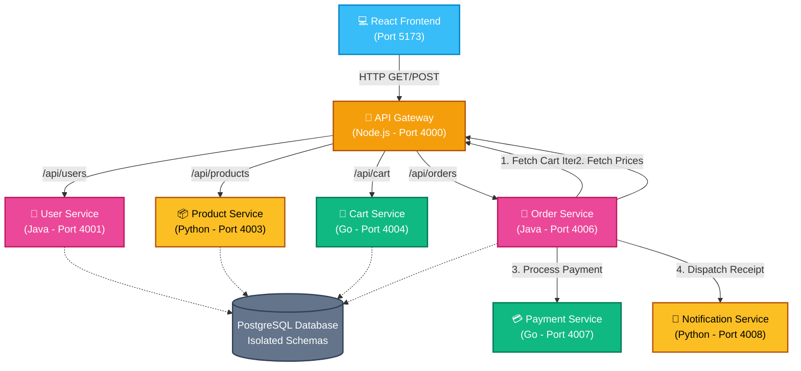

# Polyglot Microservices E-Commerce Architecture 🌐

This repository contains a full-stack, DevOps-ready e-commerce platform built using a powerful Polyglot Microservices Architecture. The backend is powered by Node.js, Java (Spring Boot), Go, and Python (FastAPI), while the frontend uses React (Vite). All services communicate via a centralized API Gateway, with the Order Service acting as a distributed orchestrator.

---

## 🏛️ Architecture Overview

The system utilizes an **API Gateway Pattern** for client ingress, and an **Orchestrator Pattern** for processing distributed transactions across isolated domains.



### 💡 The Orchestrator Flow (Checkout)
When a user clicks "Checkout", the React frontend calls the `Order Service`. The Order Service then synchronously coordinates the transaction:
1. Fetches the User's cart payload from the `Cart Service`.
2. Fetches current pricing from the `Product Service`.
3. Computes the final total and saves a `PENDING` state to the DB.
4. Triggers the `Payment Service` to authorize the charge.
5. Informs the `Notification Service` to simulate sending an email.
6. Instructs the `Cart Service` to explicitly delete the items from the basket. 
7. Upgrades the order to `COMPLETED`.

---

## 🔌 Service Port Mapping

| Service Name | Language/Framework | Port | Description |
| :--- | :--- | :--- | :--- |
| **Frontend** | React / Vite | `5173` | The Client UI. Handles auth state and Cart overlay. |
| **API Gateway** | Node.js / Express | `4000` | Central ingress point. Proxies requests to internal ports. |
| **User Service** | Java / Spring Boot | `4001` | Handles User Registration and JWT Login. |
| **Order Service** | Java / Spring Boot | `4006` | The Orchestrator. Coordinates checkout flow. |
| **Product Service** | Python / FastAPI | `4003` | Manages catalog items. |
| **Cart Service** | Go / `net/http` | `4004` | Stores volatile cart state. |
| **Inventory Service** | Node.js / Express | `4005` | Validates stock before order. |
| **Payment Service** | Go / `net/http` | `4007` | Simulates mock payment gateway transactions. |
| **Notification Service** | Python / FastAPI | `4008` | Mocks outgoing email / SMS dispatches. |

---

## 🚀 Getting Started Locally

Because this project is configured for later DevOps containerization, each service currently runs as a separate local process connected to a shared PostgreSQL database.

### Prerequisites
- Java 17+, Python 3.10+, Go 1.21+, Node 18+
- PostgreSQL running locally on `localhost:5432` with a database named `ecommerce`. 

### Running the Environment
You must open separate terminal tabs for each service and start them sequentially.

**1. Start the API Gateway & Frontend:**
```bash
cd api-gateway && npm start
cd frontend && npm run dev
```

**2. Start Python Services:**
```bash
cd product-service && python main.py
cd notification-service && python main.py
```

**3. Start Go Services:**
```bash
cd cart-service && go run .
cd payment-service && go run main.go
```

**4. Start Java Services:**
```bash
cd user-service && ./mvnw spring-boot:run
cd order-service && ./mvnw spring-boot:run
```
