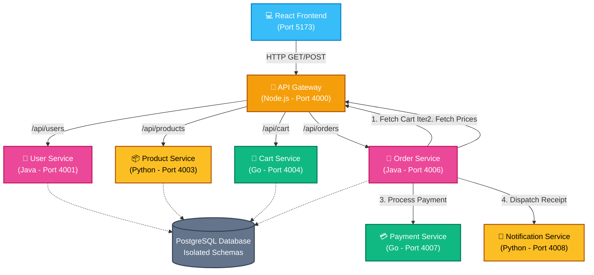
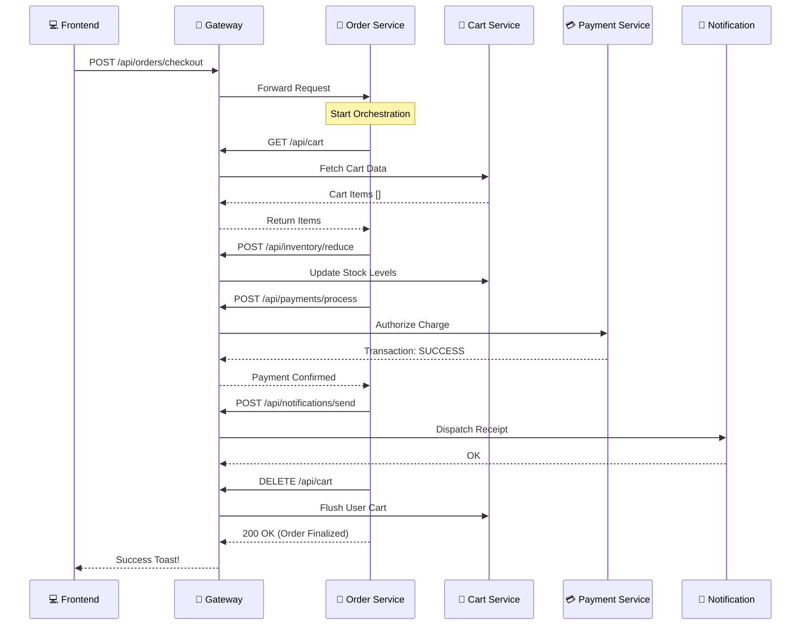

# Polyglot Microservices E-Commerce Architecture 🌐

This repository contains a full-stack, DevOps-ready e-commerce platform built using a powerful Polyglot Microservices Architecture. The backend is powered by Node.js, Java (Spring Boot), Go, and Python (FastAPI), while the frontend uses React (Vite). All services communicate via a centralized API Gateway, with the Order Service acting as a distributed orchestrator.

---

## 🏛️ Architecture Overview

The system utilizes an **API Gateway Pattern** for client ingress, and an **Orchestrator Pattern** for processing distributed transactions across isolated domains.



### 🔄 Request Orchestration Flow
To see how the "requests move" during a checkout, follow this sequence trace:



---

## ⚙️ Configuration (.env)

The application is now fully parameterized for Docker and EKS. Each service folder contains a `.env` file for local overrides. Use the **`.env.example`** at the project root as a template.

---

## 🚀 Installation & Startup

Before running the services, you must install dependencies for each environment.

### 1. Unified Gateway & Frontend (Node.js)
```bash
cd api-gateway && npm install && npm start
cd frontend && npm install && npm run dev
```

### 2. Python Services (Product & Notification)
```bash
# It is recommended to use a virtualenv
cd product-service && pip install -r requirements.txt && python main.py
cd notification-service && pip install -r requirements.txt && python main.py
```

### 3. Go Services (Cart & Payment)
```bash
# Go modules will automatically download, but you can run:
cd cart-service && go mod tidy && go run .
cd payment-service && go mod tidy && go run .
```

### 4. Java Services (User & Order)
```bash
# Maven wrapper handles everything including dependency fetch
cd user-service && ./mvnw spring-boot:run
cd order-service && ./mvnw spring-boot:run
```

---

## 🔌 Service Port Mapping

| Service Name | Language/Framework | Port | Description |
| :--- | :--- | :--- | :--- |
| **Frontend** | React / Vite | `5173` | The Client UI. Handles auth state and Cart overlay. |
| **API Gateway** | Node.js / Express | `4000` | Central ingress point. Proxies requests to internal ports. |
| **User Service** | Java / Spring Boot | `4001` | Handles User Registration and JWT Login. |
| **Order Service** | Java / Spring Boot | `4006` | The Orchestrator. Coordinates checkout flow. |
| **Product Service** | Python / FastAPI | `4003` | Manages catalog items. |
| **Cart Service** | Go / `net/http` | `4004` | Stores volatile cart state. |
| **Inventory Service** | Node.js / Express | `4005` | Validates stock before order. |
| **Payment Service** | Go / `net/http` | `4007` | Simulates mock payment gateway transactions. |
| **Notification Service** | Python / FastAPI | `4008` | Mocks outgoing email / SMS dispatches. |
